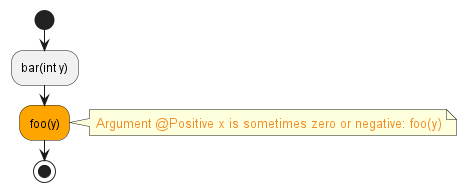
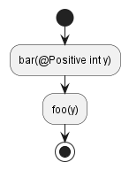
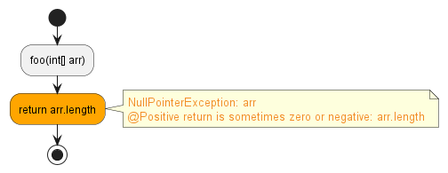
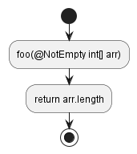

# `Annotation Errors`

Annotation errors occur when the value of an argument or return value does not satisfy the requirements
specified by annotations.

For example, the value passed to foo could be zero.
```java hl_lines="6"
public class Main {
    public void foo(@Positive int x) {
        int z = 1 / x;
    }
    public void bar(int y) {
        foo(y);
    }
}
```


This can be fixed by adding the same annotation to bar:
```java hl_lines="5"
public class Main {
    public void foo(@Positive int x) {
        int z = 1 + x;
    }
    public void bar(@Positive int y) {
        foo(y);
    }
}
```



For example, the return value could be zero if the array is empty.
```java hl_lines="3"
public class Main {
    @Positive
    public int foo(int[] arr) {
        return arr.length;
    }
}
```



This can be fixed by adding an annotation to the array parameter:
```java hl_lines="3"
public class Main {
    @Positive
    public int foo(@NotEmpty int[] arr) {
        return arr.length;
    }
}
```

