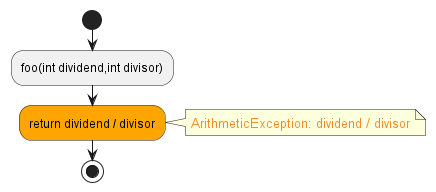
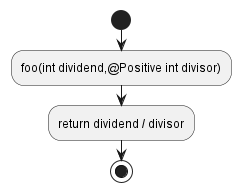

# `ArithmeticException`

A potential/definite divide by 0 was found.


For example, `divisor` could be 0:
```java hl_lines="3"
public class Main {
    public int foo(int dividend, int divisor) {
        return dividend / divisor;
    }
}
```


One way to fix this potential error is by using an annotation such as `#!java @Positive` or `#!java @Negative` to ensure that `divisor != 0`:
```java hl_lines="2"
public class Main {
    public int foo(int dividend, @Positive int divisor) {
        return dividend / divisor;
    }
}
```

