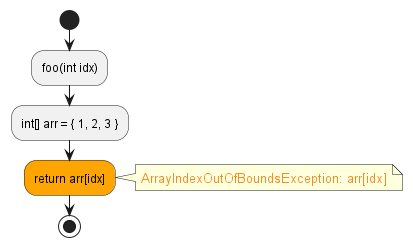
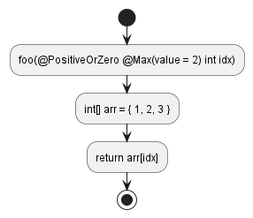

# `ArrayIndexOutOfBoundsException`

There is a potential (or definite) out of bounds array access.


In this example, there is a potential out of bounds array access if `idx` is greater than 2.
```java hl_lines="4"
public class Main {
    int foo(int idx) {
        int[] arr = {1, 2, 3};
        return arr[idx];
    }
}
```


This can be fixed by using an annotation:
```java hl_lines="2"
public class Main {
    int foo(@PositiveOrZero @Max(value=2) int idx) {
        int[] arr = {1, 2, 3};
        return arr[idx];
    }
}
```
