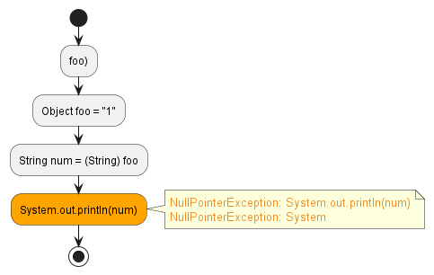

# `ClassCastException`

There was an attempt to cast an object to a subclass of which it is not an instance of.


```java hl_lines="4"
public class Main {
    public int foo() {
        Object foo = "1";
        Integer num = (Integer) foo;
        System.out.println(num);
    }
}
```


Either change the type of the variable or the type casted to:
```java hl_lines="3"
public class Main {
    public int foo() {
        Object foo = 1;
        Integer num = (Integer) foo;
        System.out.println(num);
    }
}
```


or

```java hl_lines="4"
public class Main {
    public int foo() {
        Object foo = "1";
        String num = (String) foo;
        System.out.println(num);
    }
}
```

