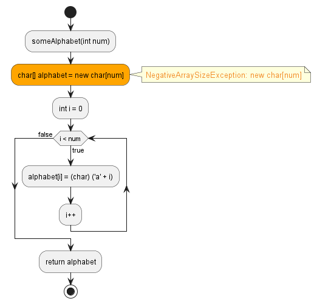
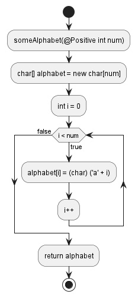

# `NegativeArraySizeException`

An array index is possibly/definitely zero.

```java hl_lines="3"
public class Main {
    public char[] someAlphabet(int num) {
        char alphabet[] = new char[num];
        for (int i = 0; i < num; i++) {
            alphabet[i] = (char)('a' + i);
        }
        return alphabet;
    }
}
```


We can use a `#!java @Positive` annotation to fix this potential exception:
```java hl_lines="2"
public class Main {
    public char[] someAlphabet(@Positive int num) {
        char alphabet[] = new char[num];
        for (int i = 0; i < num; i++) {
            alphabet[i] = (char)('a' + i);
        }
        return alphabet;
    }
}
```

