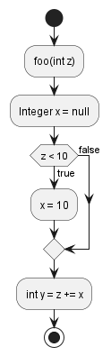

# `NullPointerException`

A possible `NullPointerException` could be thrown.

For example, `x` is possibly null:
```java hl_lines="7"
public class Main {
    public void foo(int z) {
        Integer x = null;
        if (z < 10) {
            x = 10;
        }
        int y = z += x /* (1)! */;
    }
}
```


1. `x` is potentially `null` here

Fix this error by assigning a non null value:
```java hl_lines="3"
public class Main {
    public void foo(int z) {
        Integer x = 0;
        if (z < 10) {
            x = 10;
        }
        int y = z += x /* (1)! */;
    }
}
```

1. now `x` is `10` or `0`.

